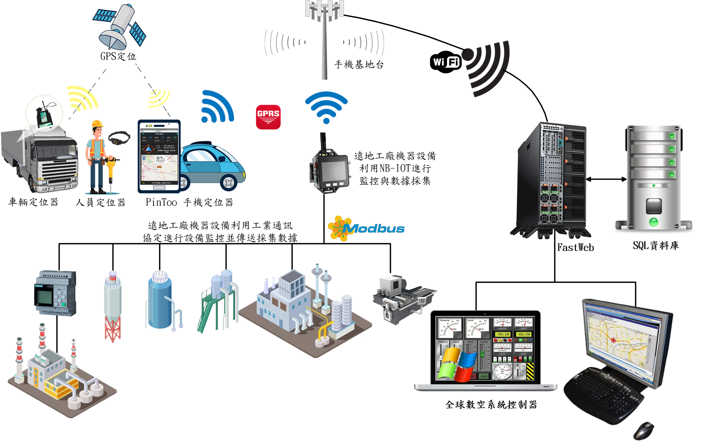
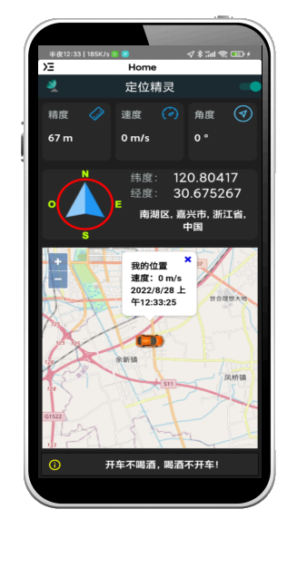
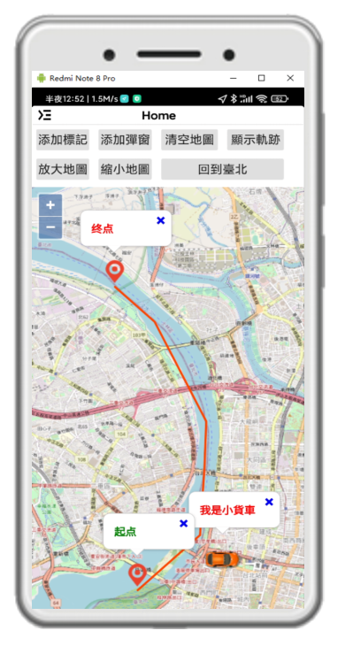

# 人車定位Position
利用 GPS 定位系統與開放的 OpenStreetMap，自製企業地圖。掌控企業因公外出之人、車、物..最新地理位址與動態，與客戶、廠商的相對關係。同時呈現在企業地圖中一覽無遺。全球數控系統超越硬體與網路傳輸限制，提供使用者智慧影像擷取服務，使用工業通訊協定，將遠地機器設備、資產、進行地圖定位與即時監控、採集數據。所有定位與採集監控數據回傳雲端平臺，精準掌握企業脈動。

> **加入 Facebook 社團**
>
> [https://www.facebook.com/groups/isoface/](https://www.facebook.com/groups/isoface/)
> 
> **點讚追蹤 Facebook 粉絲專頁**
> 
> [https://www.facebook.com/AIOT.ERP](https://www.facebook.com/AIOT.ERP)

數控中心―定位系統有以下三大功能，分敘如下：

## 一、企業車輛e化與定位管理

傳統透過人工與紙筆作業方式來管理企業車輛，不僅費時費力，更容易因為人為的疏失而導致管理上的漏洞，所以將管理作業轉為數位化，所有企業公務車輛、貨車...等各式車種定位系統，掌握車輛動態，提升營運效率及駕駛安全，強化企業競爭，是企業降低營運成本、提升績效的首要步驟。

1. 車輛監控 → 同時監控車輛動態，行車資訊一手掌握

2. 績效管理 → 靈活調度車輛使用，有效提升人員效率，省去不必要的油耗

3. 駕駛管理 → 掌握車輛與駕駛情況，導正超速、怠速、失去聯絡等情形。
 
4. 客戶管理 → 提供自行設定地標功能，方便車輛派遣管理

5. 軌跡追蹤 → 雲端伺服器軌跡儲存，查詢紀錄好方便

6. 個人防盜 → 機身輕巧隱密，不易被竊賊發現；定位精準穩定，及時找回失竊車輛

7. 企業管理 → 透過各式數據了解業務的行程已經車輛使用情況，企業e化好簡單!

## 二、企業人員移動式管理

借助定位功能實現人員考勤、作業狀態等資訊進行即時監管，借助手機APP收集到的位置資訊，通過4G通訊上傳至雲平臺進行處理，即時掌握作業人員的工作狀態、工作資訊和工作歷史，進而達到智慧規劃、即時調度、自動考核等目的。

1. 業務與公務人員外出管理

    業務人員拜訪客戶，需要回公司填表，現在通過手機就可以傳回這些資料；還可生成拜訪客戶的路線圖，減少員工重複性勞動。通過這種方式，企業可以掌握每個業務員是否在崗、是否花精力在自己的業務上。管理人員利用電腦設備，就可以從企業地圖上看到所有業務員目前在什麼地方，停留時間是多久，行進的路線圖。企業利用手機定位的做法，是利用高科技提高工作效率，不涉及侵犯員工隱私。

2. 遠地上班打卡

    因應疫情來襲，許多企業讓員工在家遠距上班；不過，有些企業主可能會認為，員工遠距上班行蹤難以掌握，而全球數控系統藉GPS定位，進行上下班差勤打卡，讓勞資雙方無痛升級使用。

3. 維護工務人員外出工作安全

    全球數控系統, 可以協助獨立執行任務的人員在執行風險或潛在危險的工作和任務時，隨時定位訊號，隨時可監控及線上支援獨立的作業人員所在位址，讓單獨作業的公務人員的工作和安全更有保障！

    

## 三、協助企業在工業物聯網的運用。

協助企業將遠端資產設備進行定位設置、數據採集、監控服務。全球數控系統利用網際網路或NB-IoT基站連接伺服器中心，將採集數據通過無線蜂窩網上傳至伺服器中心。例如分布在各地的儀表數據採集，進行週期性採樣，並對資料進行打包。按照一定的發送週期進行資料的上傳。採集終端設備通過無線方式對智慧計量表進行週期性資料獲取，並通過窄帶物聯網技術以無線方式上傳至基站，因此採集終端本質上是一個相對獨立的電子系統，具有超低功耗、睡眠喚醒工作模式智慧切換等特點。全球數控系統應用於工廠自動化、流程優化、供應鏈優化、提高安全性和業務整合流程。

* 數控中心―定位系統採用PinToo開發手機APP

    全球數控系統超越硬體及網路傳輸限制，提供使用者獨一無二智慧影像擷取服務的解決方案。對於車輛行進間發生事件，智慧擷影，主動進行即時影像擷取並回傳雲端平台，精準掌握駕駛行為之關鍵影像』的行車影像管理目的。在工業物聯網的運用，可將遠地機器設備、資產、進行地圖定位與即時監控。可偵測項目包括超速、未定位、超越行車地區、影像擷取與通訊、文字訊息傳送。其它功能還可擴充工業通訊協定，利用感測器採集數據，進行遠程工控作業。PinToo所設計的定位系統，可使用 Android 手機、樹莓派、香蕉派、橘子派....各式 ARM開發板。

* 數控中心―定位系統採用FastWeb開發網頁應用
    
    企業管理人員使用網頁瀏覽器，隨時掌握企業人、車、物..因公外出的移動狀況。

